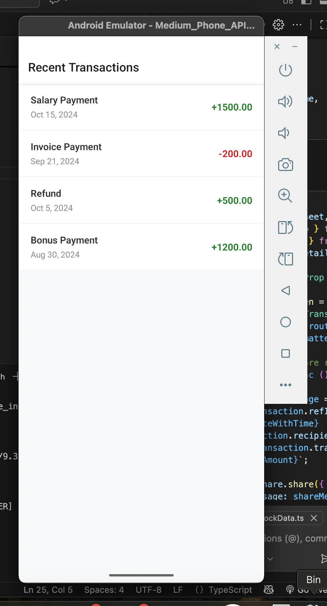
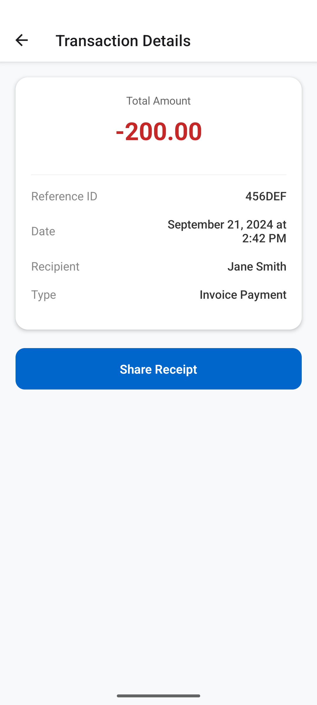
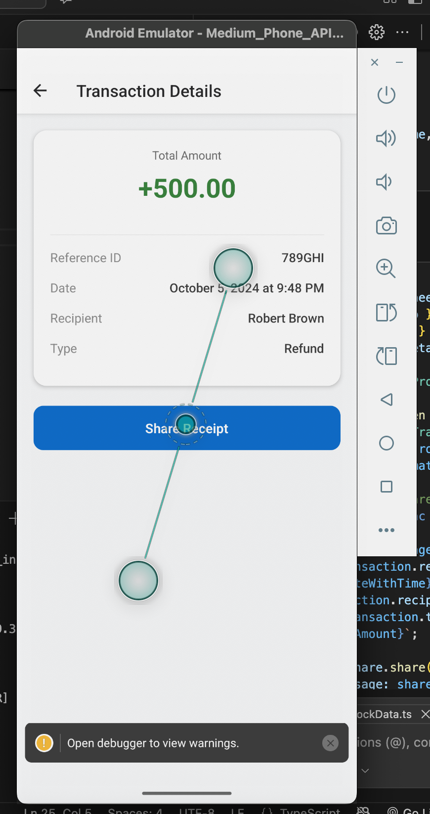
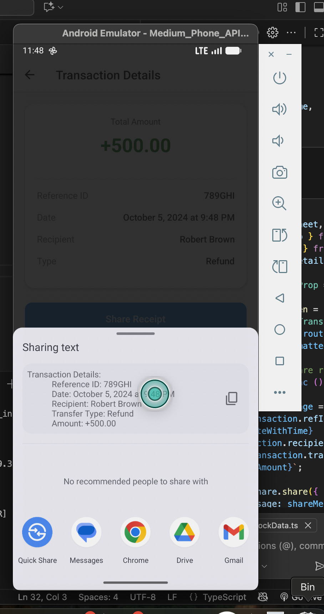

md_content = """# AEON Bank Mobile Engineer Assessment

This repository contains the solution for the AEON Bank Mobile Engineer Assessment. It is a React Native application that allows users to view a list of recent transactions, see transaction details, and share receipts using the device's native share capabilities.

## 🛠 Tech Stack
* **Framework:** React Native (CLI)
* **Language:** TypeScript
* **State Management:** Zustand
* **Navigation:** React Navigation (Native Stack)

## 📋 Prerequisites
Before running the application, ensure you have the following installed:
* **Node.js** (v18+ recommended)
* **Watchman** (for macOS/Linux)
* **Ruby and CocoaPods** (for iOS development)
* **Xcode** (for iOS) & **Android Studio** (for Android)
* Ensure your React Native CLI environment is properly configured. If not, follow the [React Native Environment Setup Guide](https://reactnative.dev/docs/environment-setup).

## 🚀 Installation & Setup

1. **Clone the repository:**

## 📸 App Showcase

  
  &nbsp;&nbsp;&nbsp;
  
  &nbsp;&nbsp;&nbsp;
  
  &nbsp;&nbsp;&nbsp;
  
  

